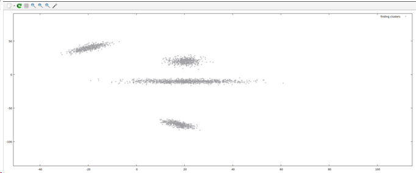
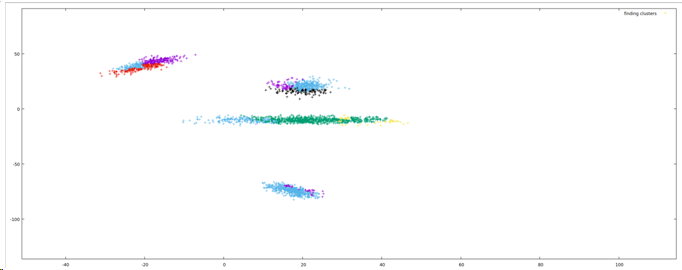
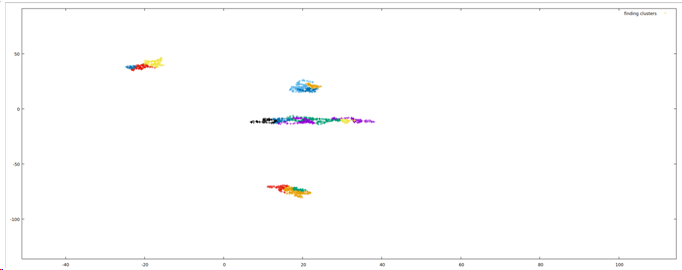
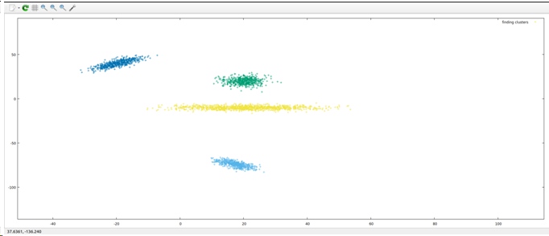
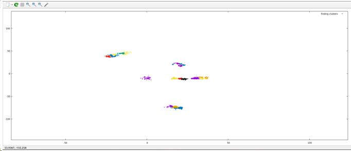

Эта ветка предназначена для проекта на C++, в котором ищутся кластеры точек следующим способами:

* Sptr
* Forel
* Dbcan

Примеры работы:

* Без поиска кластеров:

* С найденными кластерами:

* Поиск другим алгоритмом:

* Поиск при других параметрах:

* Еще один пример:

